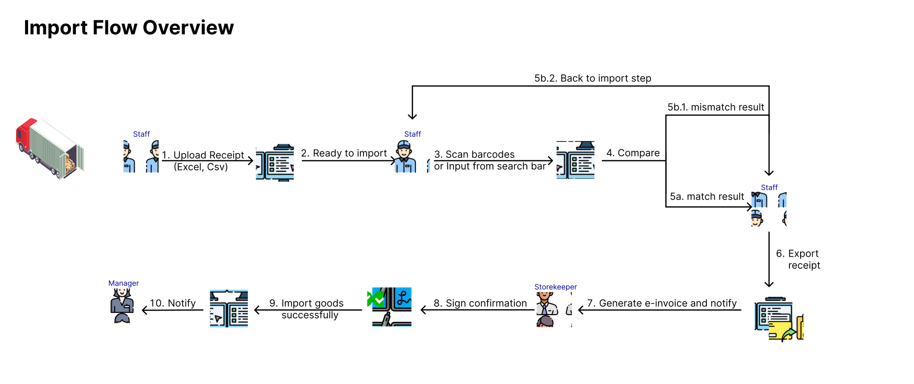
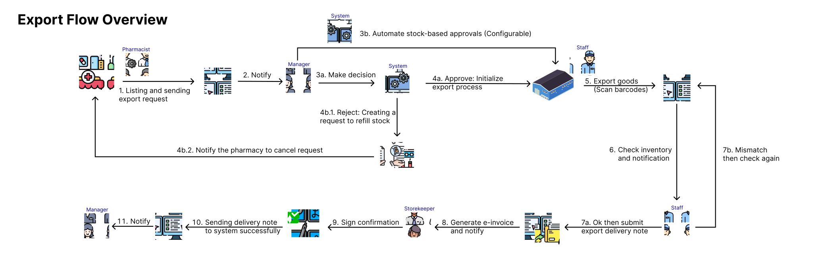
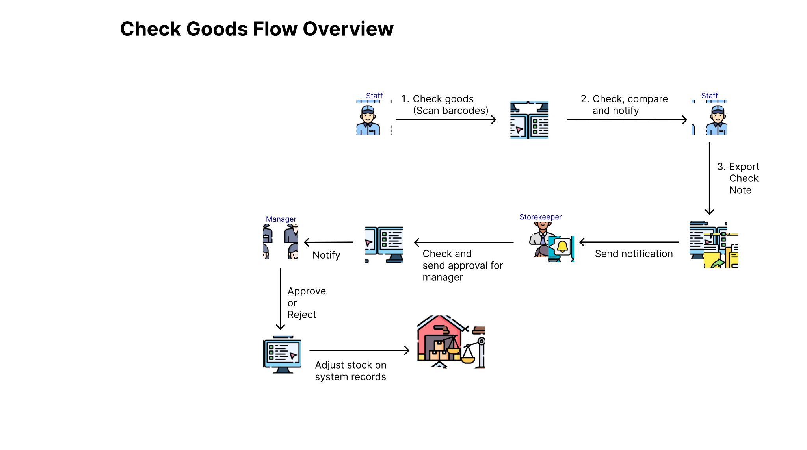
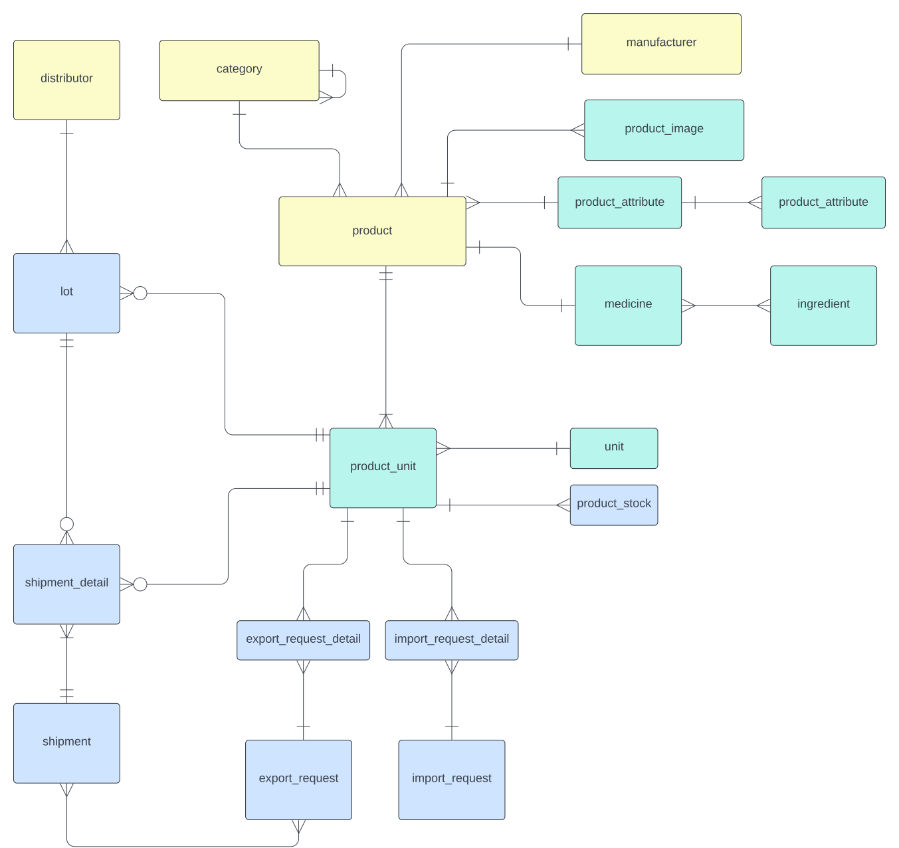

# Pharmacy Inventory Management System Proposal
This is an system built for chains of pharmacy system to manage their inventory which imports from distributors and supplies for their sale stores.
This system written mainly in **.NET** and deploy automatically using **Docker/GithubAction**
Web admin client written in **React** and utilized **React's ecosystem** (**Tanstack Query, Tanstack Table, Mantis**).

Other versions in Java Spring/NestJs can be found at:

## I. Technical stack

- Monolith MVC main service in **.NET 8**
- Infrastructure
  - **MySQL, Redis**
  - Third party: **Firebase, S3**
  - **Docker and docker-compose**
  - staging container for reproducible development environment
## II. Proposal system flows
### 1. Import flow 

### 2. Export flow

### 3. Check goods flow

## III. Development

### 1. Overal Architecture

### 2. Concept ERD

### 3. Backend Structural Organization

### 4. Frontend Structural Organization

## IV. Demonstration
### 1. Video

### 2. Screenshots
#### a. Web
#### b. Mobile

## V. Team members
- [Trinh Khanh Linh (Lead)](https://github.com/khanhlinh2601)
- [Le Thanh Phong](https://github.com/xWyvernPx)
- [Bui Dang Khoa](https://github.com/buidangkhoa05)
- [Nguyen Manh Hung](https://github.com/jinergenkai)
- [Nguyen Gia Tin](https://github.com/YatinCyber)
# Roadmap

- ✅ Add import flow (Basic - Assumption : enough resource/stock for exporting)
- ✅ Add export flow  (Basic)
- ✅ Add manage product flow
- 🕛 Dashboard
- Add Export flow (Partialy)
## Disclaimer
This project repository serves as a demonstration and proposal for stakeholders only. It does not disclose any core or internal system functionalities. The contents, including but not limited to technical stack, proposal system flows, development details, and team members, are presented solely for the purpose of showcasing the project's capabilities and potential.

Please note that this project is closed-source, and the code and related materials provided in this repository are not intended for reproduction, redistribution, or use in any other context without explicit permission from the project owners.

Any unauthorized use, reproduction, or distribution of the contents of this repository is strictly prohibited and may result in legal action.

Thank you for your understanding.

